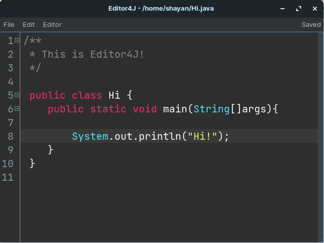
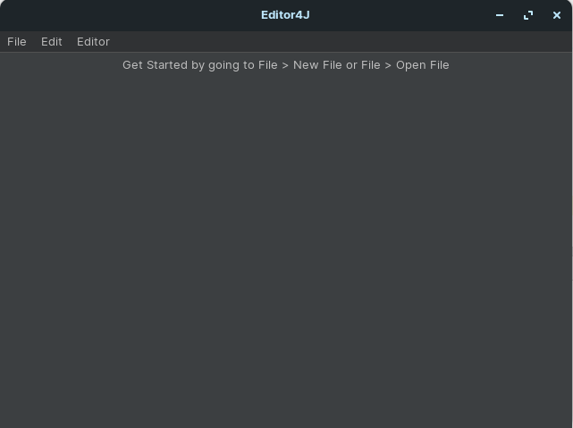

# Welcome Reader!

This is the *old* repository for Editor4J. Do not use this for daily use. But you're free to build and run it
for historical purposes. Check out https://www.github.com/skyloft7/Editor4J-new instead!

Editor4J is a cross-platform easy to use code-editor for learners that doesn't overwhelm you like professional-grade IDE's.
It's free and open-source under the GPL v2 license. 

Check out what's going on at the Editor4J Trello Board: 

https://trello.com/b/rQzfj5GZ/editor4j-20222

The latest version is 2022.1, but 2022.2 is in progress right now.

