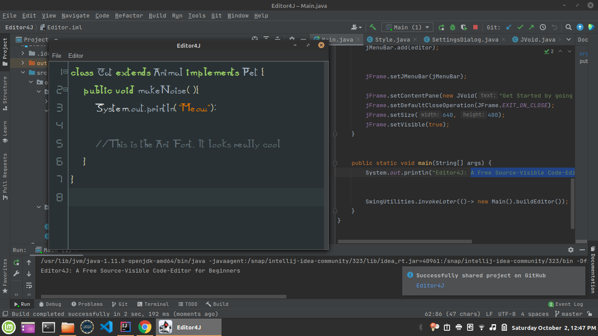

# Editor4J
A simple open source code-editor for learning Java in the classroom

Update: Editor4J now uses Gradle to build. I'm still learning the ropes when it comes to Gradle and Git. 
So before the first release the repo is gonna look like a mess. Hopefully before Release 2 it'll look sane :)

Editor4J is built on the SourceBear platform. An easy to use Source Code Editor component for Swing. It's
designed to look good, and have an intuitive API.
